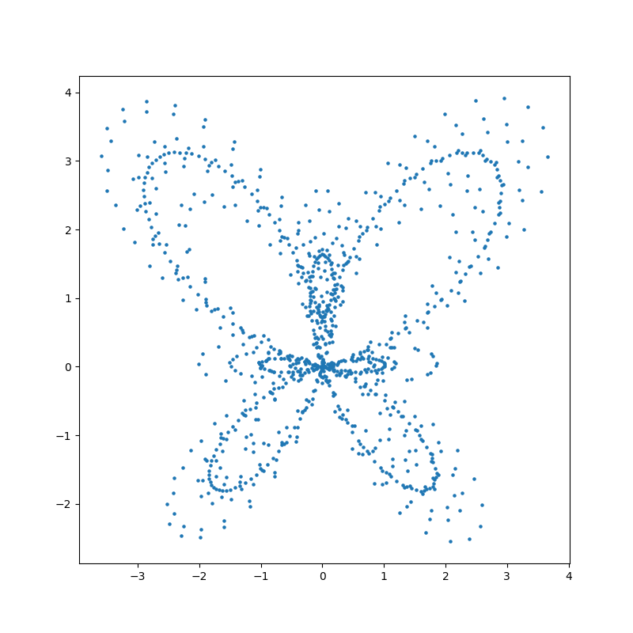
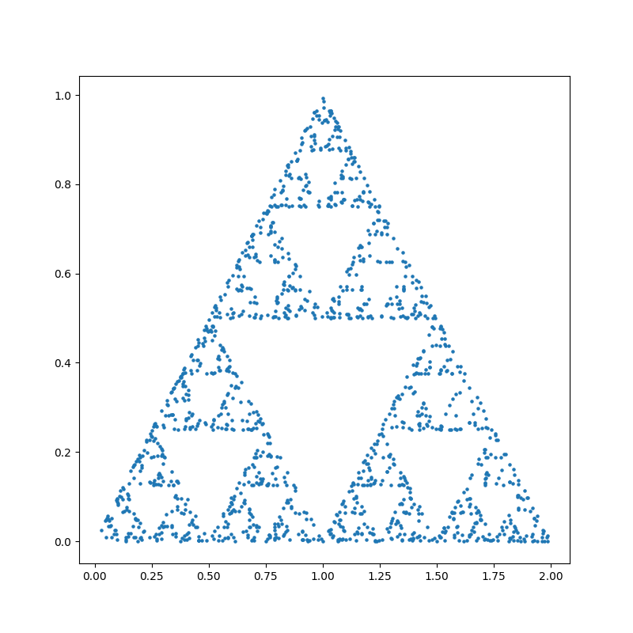

# Mathematical Fun

There are lots of interesting shapes in mathematics, let's visualize them.

## Usage

1. Make sure you have python, numpy and matplotlib installed.
2. Run `main.py` and create some plots.

## Sample Plots

Butterfly Curve \

Sierpinski Triangle \

## Contributions

If you know a cool curve equation, or you find a bug in this repository, feel free to contribute.

